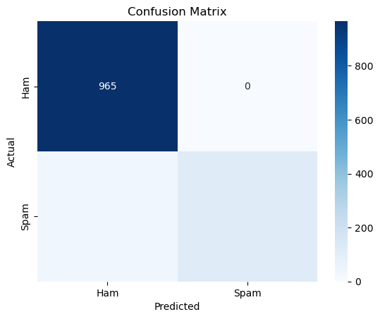

.. code:: ipython3

    import pandas as pd
    from sklearn.model_selection import train_test_split
    from sklearn.feature_extraction.text import TfidfVectorizer
    from sklearn.naive_bayes import MultinomialNB
    from sklearn.metrics import classification_report, accuracy_score

.. code:: ipython3

    data = pd.read_csv(r'C:\Users\agri2024\Downloads\PP6\spam.csv', encoding='ISO-8859-1')
    data.head()

.. raw:: html

    

    
    <table border="1" class="dataframe">
      <thead>
        <tr style="text-align: right;">
          <th></th>
          <th>v1</th>
          <th>v2</th>
          <th>Unnamed: 2</th>
          <th>Unnamed: 3</th>
          <th>Unnamed: 4</th>
        </tr>
      </thead>
      <tbody>
        <tr>
          <th>0</th>
          <td>ham</td>
          <td>Go until jurong point, crazy.. Available only ...</td>
          <td>NaN</td>
          <td>NaN</td>
          <td>NaN</td>
        </tr>
        <tr>
          <th>1</th>
          <td>ham</td>
          <td>Ok lar... Joking wif u oni...</td>
          <td>NaN</td>
          <td>NaN</td>
          <td>NaN</td>
        </tr>
        <tr>
          <th>2</th>
          <td>spam</td>
          <td>Free entry in 2 a wkly comp to win FA Cup fina...</td>
          <td>NaN</td>
          <td>NaN</td>
          <td>NaN</td>
        </tr>
        <tr>
          <th>3</th>
          <td>ham</td>
          <td>U dun say so early hor... U c already then say...</td>
          <td>NaN</td>
          <td>NaN</td>
          <td>NaN</td>
        </tr>
        <tr>
          <th>4</th>
          <td>ham</td>
          <td>Nah I don't think he goes to usf, he lives aro...</td>
          <td>NaN</td>
          <td>NaN</td>
          <td>NaN</td>
        </tr>
      </tbody>
    </table>
    

.. code:: ipython3

    data = data[['v1', 'v2']]
    data.head()

.. raw:: html

    

    
    <table border="1" class="dataframe">
      <thead>
        <tr style="text-align: right;">
          <th></th>
          <th>v1</th>
          <th>v2</th>
        </tr>
      </thead>
      <tbody>
        <tr>
          <th>0</th>
          <td>ham</td>
          <td>Go until jurong point, crazy.. Available only ...</td>
        </tr>
        <tr>
          <th>1</th>
          <td>ham</td>
          <td>Ok lar... Joking wif u oni...</td>
        </tr>
        <tr>
          <th>2</th>
          <td>spam</td>
          <td>Free entry in 2 a wkly comp to win FA Cup fina...</td>
        </tr>
        <tr>
          <th>3</th>
          <td>ham</td>
          <td>U dun say so early hor... U c already then say...</td>
        </tr>
        <tr>
          <th>4</th>
          <td>ham</td>
          <td>Nah I don't think he goes to usf, he lives aro...</td>
        </tr>
      </tbody>
    </table>
    

.. code:: ipython3

    data.shape

.. parsed-literal::

    (5572, 2)

.. code:: ipython3

    null_values = data.isnull().sum()
    
    
    null_percentage = (data.isnull().sum() / len(data)) * 100
    
    print("Null values in each column:")
    print(null_values)
    print("\nPercentage of null values in each column:")
    print(null_percentage)
    

.. parsed-literal::

    Null values in each column:
    v1    0
    v2    0
    dtype: int64
    
    Percentage of null values in each column:
    v1    0.0
    v2    0.0
    dtype: float64
    

.. code:: ipython3

    data.rename(columns={'v1': 'label', 'v2': 'text'}, inplace=True)
    data.head()

.. raw:: html

    

    
    <table border="1" class="dataframe">
      <thead>
        <tr style="text-align: right;">
          <th></th>
          <th>label</th>
          <th>text</th>
        </tr>
      </thead>
      <tbody>
        <tr>
          <th>0</th>
          <td>ham</td>
          <td>Go until jurong point, crazy.. Available only ...</td>
        </tr>
        <tr>
          <th>1</th>
          <td>ham</td>
          <td>Ok lar... Joking wif u oni...</td>
        </tr>
        <tr>
          <th>2</th>
          <td>spam</td>
          <td>Free entry in 2 a wkly comp to win FA Cup fina...</td>
        </tr>
        <tr>
          <th>3</th>
          <td>ham</td>
          <td>U dun say so early hor... U c already then say...</td>
        </tr>
        <tr>
          <th>4</th>
          <td>ham</td>
          <td>Nah I don't think he goes to usf, he lives aro...</td>
        </tr>
      </tbody>
    </table>
    

.. code:: ipython3

    # Using one-hot encoding
    one_hot_encoded_labels = pd.get_dummies(data['label'])
    print(one_hot_encoded_labels.head())
    
    #

.. parsed-literal::

         ham   spam
    0   True  False
    1   True  False
    2  False   True
    3   True  False
    4   True  False
    

.. code:: ipython3

    one_hot_encoded = pd.get_dummies(data['label'])
    one_hot_encoded = one_hot_encoded.astype(int)
    print(one_hot_encoded.head())
    print(data.head(15))
    

.. parsed-literal::

       0  1
    0  1  0
    1  1  0
    2  0  1
    3  1  0
    4  1  0
        label                                               text
    0       0  Go until jurong point, crazy.. Available only ...
    1       0                      Ok lar... Joking wif u oni...
    2       1  Free entry in 2 a wkly comp to win FA Cup fina...
    3       0  U dun say so early hor... U c already then say...
    4       0  Nah I don't think he goes to usf, he lives aro...
    5       1  FreeMsg Hey there darling it's been 3 week's n...
    6       0  Even my brother is not like to speak with me. ...
    7       0  As per your request 'Melle Melle (Oru Minnamin...
    8       1  WINNER!! As a valued network customer you have...
    9       1  Had your mobile 11 months or more? U R entitle...
    10      0  I'm gonna be home soon and i don't want to tal...
    11      1  SIX chances to win CASH! From 100 to 20,000 po...
    12      1  URGENT! You have won a 1 week FREE membership ...
    13      0  I've been searching for the right words to tha...
    14      0                I HAVE A DATE ON SUNDAY WITH WILL!!
    

.. code:: ipython3

    tfidf = TfidfVectorizer(stop_words='english', max_df=0.7)

.. code:: ipython3

    X = tfidf.fit_transform(data['text'])
    y = data['label']

.. code:: ipython3

    X_train, X_test, y_train, y_test = train_test_split(X, y, test_size=0.2, random_state=42)
    print(X_train.shape)
    print(X_test.shape)

.. parsed-literal::

    (4457, 8404)
    (1115, 8404)
    

.. code:: ipython3

    model = MultinomialNB()
    model.fit(X_train, y_train)

.. raw:: html

    

<pre>MultinomialNB()</pre><b>In a Jupyter environment, please rerun this cell to show the HTML representation or trust the notebook.  On GitHub, the HTML representation is unable to render, please try loading this page with nbviewer.org.</b>

<input class="sk-toggleable__control sk-hidden--visually" id="sk-estimator-id-1" type="checkbox" checked><label for="sk-estimator-id-1" class="sk-toggleable__label fitted sk-toggleable__label-arrow fitted">&nbsp;&nbsp;MultinomialNB<a class="sk-estimator-doc-link fitted" rel="noreferrer" target="_blank" href="https://scikit-learn.org/1.5/modules/generated/sklearn.naive_bayes.MultinomialNB.html">?Documentation for MultinomialNB</a>iFitted</label>
<pre>MultinomialNB()</pre>
 

.. code:: ipython3

    y_pred = model.predict(X_test)

.. code:: ipython3

    print("Accuracy:", accuracy_score(y_test, y_pred))
    print("\nClassification Report:\n", classification_report(y_test, y_pred))

.. parsed-literal::

    Accuracy: 0.968609865470852
    
    Classification Report:
                   precision    recall  f1-score   support
    
               0       0.96      1.00      0.98       965
               1       1.00      0.77      0.87       150
    
        accuracy                           0.97      1115
       macro avg       0.98      0.88      0.93      1115
    weighted avg       0.97      0.97      0.97      1115
    
    

.. code:: ipython3

    from sklearn.metrics import confusion_matrix
    import seaborn as sns
    import matplotlib.pyplot as plt

.. code:: ipython3

    cm = confusion_matrix(y_test, y_pred)
    print(cm)

.. parsed-literal::

    [[965   0]
     [ 35 115]]
    

.. code:: ipython3

    sns.heatmap(cm, annot=True, fmt='d', cmap='Blues', xticklabels=['Ham', 'Spam'], yticklabels=['Ham', 'Spam'])
    plt.ylabel('Actual')
    plt.xlabel('Predicted')
    plt.title('Confusion Matrix')
    plt.show()

.. code:: ipython3

    """# Plotting actual vs predicted values
    plt.figure(figsize=(10, 5))
    
    # Create a DataFrame to hold actual and predicted values
    results_df = pd.DataFrame({
        'actual': y_test,
        'predicted': y_pred
    })
    
    # Plot actual values
    plt.plot(results_df.index, results_df['actual'], marker='o', label='Actual', color='blue')
    
    # Plot predicted values
    plt.plot(results_df.index, results_df['predicted'], marker='x', label='Predicted', color='orange')
    
    # Adding labels and title
    plt.title('Actual vs Predicted Labels')
    plt.xlabel('Sample Index')
    plt.ylabel('Label (0 = Ham, 1 = Spam)')
    plt.xticks(results_df.index)  
    plt.yticks([0, 1])     
    plt.legend()
    plt.grid()
    plt.show()"""

.. parsed-literal::

    "# Plotting actual vs predicted values\nplt.figure(figsize=(10, 5))\n\n# Create a DataFrame to hold actual and predicted values\nresults_df = pd.DataFrame({\n    'actual': y_test,\n    'predicted': y_pred\n})\n\n# Plot actual values\nplt.plot(results_df.index, results_df['actual'], marker='o', label='Actual', color='blue')\n\n# Plot predicted values\nplt.plot(results_df.index, results_df['predicted'], marker='x', label='Predicted', color='orange')\n\n# Adding labels and title\nplt.title('Actual vs Predicted Labels')\nplt.xlabel('Sample Index')\nplt.ylabel('Label (0 = Ham, 1 = Spam)')\nplt.xticks(results_df.index)  \nplt.yticks([0, 1])     \nplt.legend()\nplt.grid()\nplt.show()"

.. code:: ipython3

    new_messages = ["How are you", "Hey, are we still on for lunch today?", "you had win a mega offer,click  here to win", "Can you send me the report by tonight?","you had recieve the price please contact us to recieve your price"]
    
    new_messages_transformed = tfidf.transform(new_messages)
    predictions = model.predict(new_messages_transformed)
    for msg, label in zip(new_messages, predictions):
        print(f"Message: {msg} -> Prediction: {'Spam' if label == 1 else 'Ham'}")
    

.. parsed-literal::

    Message: How are you -> Prediction: Ham
    Message: Hey, are we still on for lunch today? -> Prediction: Ham
    Message: you had win a mega offer,click  here to win -> Prediction: Spam
    Message: Can you send me the report by tonight? -> Prediction: Ham
    Message: you had recieve the price please contact us to recieve your price -> Prediction: Ham
    

.. code:: ipython3

    import joblib
    
    
    joblib.dump(model, r'C:\Users\agri2024\Downloads\PP6\spam_detection_model.pkl')  # Save the model as a .pkl file
    print("Saving Successful")

.. parsed-literal::

    Saving Successful
    

.. code:: ipython3

    # Load the model from the file
    with open('spam_detection_model.pkl', 'rb') as model_file:
        loaded_model = pickle.load(model_file)
    
    # Now you can use loaded_model to make predictions
    y_pred_loaded = loaded_model.predict(X_test_vectorized)
    
